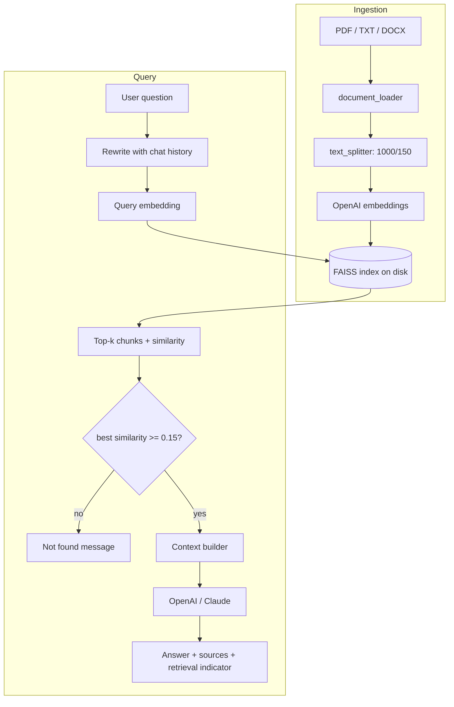

# Project Guide

## 1. How the RAG pipeline works
Upload → `document_loader` extracts text per page → `text_splitter` makes 1000-char chunks
(150 overlap so sentences aren't cut off from context) → `vector_store` embeds and stores them in
FAISS (saved to disk). On a question: (optional) rewrite follow-up into a standalone question →
embed it → FAISS returns the top-k nearest chunks → if the best similarity is below 0.15 we reply
"couldn't find enough information" without calling the LLM → otherwise chunks become a labeled
context block → the strict prompt makes the LLM answer only from it → UI shows answer + sources.

## 2. How embeddings work
An embedding model turns text into a list of ~1,500 numbers so that texts with similar *meaning*
land close together ("supervised learning" and "learning from labeled data" are near each other,
"pizza recipe" is far). Chunks and questions are embedded with the same model, so "closest vector"
means "most related passage". This is why search works without keyword matches.

## 3. How FAISS works
FAISS (Facebook AI Similarity Search) is a library that stores vectors and finds nearest neighbours
very quickly. We use the default flat L2 index: exact search comparing the query vector with every
stored vector. Because OpenAI vectors are unit length, L2 distance converts to cosine similarity
(`cos = 1 - d²/2`), which is what the UI shows. LangChain's `FAISS` wrapper also keeps a docstore
mapping each vector to its chunk text + metadata, and `save_local`/`load_local` persist both.

## 4. How LangChain connects the components
`Document` objects carry text + metadata everywhere. `RecursiveCharacterTextSplitter` chunks them,
`OpenAIEmbeddings` embeds them, `FAISS` stores/searches them, and the answer path is an LCEL chain:
`ChatPromptTemplate | chat_model | StrOutputParser`. Swapping OpenAI for Claude only changes the
chat-model object returned by `llm.get_llm()`.

## 5. How OpenAI / Claude are used
Embeddings always use OpenAI (`text-embedding-3-small`). For answers, the sidebar picks
`ChatOpenAI` (`gpt-4o-mini`) or `ChatAnthropic` (`claude-sonnet-4-6`). Temperature is 0. Model names
live only in `src/config.py` and can be overridden with env vars. Check the providers' docs for the
latest model names if one is retired.

## 6. How source citations work
Each chunk keeps `source` (filename) and `page` metadata from loading time. After retrieval we
list the unique `file — Page N` labels of exactly the chunks sent to the LLM. If the answer is
"not found", sources are hidden because none were actually used. DOCX/TXT have no pages, so only
the filename is shown.

## 7. Run locally
See README → Installation.

## 8. Test it
`pytest -q` — 20 offline tests using `DeterministicFakeEmbedding` and `FakeListChatModel`;
no API calls or cost.

## 9. Upload to GitHub
```bash
git init
git add .
git status            # confirm .env is NOT listed
git commit -m "Initial commit: AI Chatbot with RAG"
git branch -M main
git remote add origin https://github.com/<you>/rag-chatbot.git
git push -u origin main
```

## 10. Deploy on Streamlit Community Cloud
1. Push the repo to GitHub (public or private).
2. Go to share.streamlit.io → **New app** → pick repo, branch `main`, main file `app.py`.
3. **Advanced settings → Secrets**, paste:
   ```toml
   OPENAI_API_KEY = "sk-..."
   ANTHROPIC_API_KEY = "sk-ant-..."
   ```
   (Streamlit exposes top-level secrets as environment variables, which `os.getenv` reads.)
4. Deploy. Note: the disk is ephemeral — uploads/index reset on restart; users re-process documents.

## Sample test documents & questions
1. **ML notes (PDF/TXT)** — "What is supervised learning?" → follow-up "Give me an example."
2. **Python course PDF** — "What is the difference between a list and a tuple?"
3. **College FAQ (DOCX)** — "What is the attendance requirement?"
4. **Company policy PDF** — "How many days of paid leave do employees get?"
5. **Any of the above** — "Who is the president of France?" (should say it couldn't find it)

## 10 interview questions
1. Why chunk documents, and how did you choose size and overlap?
2. How do embeddings enable semantic search vs keyword search?
3. Why FAISS? What are its limits, and when would you move to Pinecone/pgvector?
4. How do you reduce hallucinations in this system?
5. Why isn't similarity score the same as confidence?
6. How do follow-up questions like "give me an example" work with retrieval?
7. How would you evaluate retrieval and answer quality (recall@k, faithfulness, RAGAS)?
8. What would you do for hybrid search or reranking?
9. How do you avoid re-embedding on every query, and how do you handle updated documents?
10. What security concerns exist (API keys, uploads, pickle deserialization)?

## Resume bullets
- Built a production-style RAG chatbot in Python (LangChain, FAISS, Streamlit) answering questions over user-uploaded PDF/DOCX/TXT files with page-level source citations.
- Implemented chunking, OpenAI embeddings, persistent FAISS vector search and a provider-agnostic LLM layer supporting OpenAI and Anthropic Claude.
- Reduced hallucinations with a similarity-threshold gate, strict grounding prompt, and follow-up question rewriting for multi-turn chat.
- Wrote a modular codebase with typed APIs, custom error handling and 20 offline unit tests using mocked embeddings/LLMs.

## GitHub README description (short)
Document Q&A chatbot using Retrieval Augmented Generation: LangChain + FAISS + OpenAI embeddings, with OpenAI/Claude answers, source citations and hallucination guards. Built with Streamlit.

## Architecture diagram (Mermaid)

