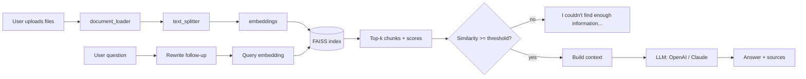

# AI Chatbot with RAG

Ask questions about your own PDF, TXT and DOCX files. Answers are generated by an LLM
**only from retrieved document passages**, with source citations and hallucination guards.

## Overview
A Streamlit app implementing a genuine Retrieval Augmented Generation pipeline:
OpenAI embeddings + FAISS similarity search + OpenAI or Anthropic Claude for answers,
with conversational follow-ups.

## Features
- Upload multiple PDF / TXT / DOCX files; metadata (filename, page, type) preserved
- Configurable chunk size, overlap and top-k
- Persistent FAISS index (embeddings are computed once, not per question)
- OpenAI or Claude selectable in the UI
- Follow-up questions ("give me an example") via standalone-question rewriting
- Source citations (file + page) and a retrieval-similarity indicator
- Two hallucination guards (similarity threshold + strict prompt)
- Friendly handling of missing keys, corrupt/empty files, API and index errors

## Architecture


## Tech Stack
Python 3.11+, Streamlit, LangChain (core / community / text-splitters / openai / anthropic),
FAISS (faiss-cpu), pypdf, python-docx, python-dotenv, pytest.

## How RAG Works
Documents → **Chunking** (split into ~1000-char overlapping pieces) → **Embeddings**
(each chunk becomes a vector capturing its meaning) → **FAISS** (stores vectors, finds
nearest ones fast) → **Retrieval** (embed the question, fetch top-k chunks) → **Context**
(chunks joined with source labels) → **LLM** (told to answer only from context) → **Answer**.

## Project Structure
```
rag-chatbot/
├── app.py                  # Streamlit UI, session state, wiring
├── requirements.txt
├── .env.example            # API-key template (copy to .env)
├── .gitignore              # ignores .env, data, indexes
├── data/                   # uploaded files (git-ignored)
├── vectorstore/            # saved FAISS index (git-ignored)
├── src/
│   ├── config.py           # models, defaults, thresholds (single source of truth)
│   ├── document_loader.py  # PDF/TXT/DOCX -> Documents + metadata
│   ├── text_splitter.py    # RecursiveCharacterTextSplitter wrapper
│   ├── embeddings.py       # OpenAI embeddings factory
│   ├── vector_store.py     # FAISS build / save / load / add / clear / rebuild
│   ├── retriever.py        # similarity search + score normalisation
│   ├── llm.py              # OpenAI / Claude chat-model factory
│   ├── rag_chain.py        # prompts, context building, full RAG pipeline
│   └── utils.py            # exceptions, filename safety, formatting
└── tests/test_rag.py       # offline tests (fake embeddings + fake LLM)
```

## Quick start (Windows)
Double-click `setup.bat` once (installs everything and opens `.env` for your key), then double-click `run.bat` any time to start the app. macOS/Linux: `bash setup.sh`.

## Installation
```bash
python -m venv venv
# Windows: venv\Scripts\activate      macOS/Linux: source venv/bin/activate
pip install -r requirements.txt
cp .env.example .env     # then add your keys
streamlit run app.py
```
`OPENAI_API_KEY` is always required (embeddings). `ANTHROPIC_API_KEY` is only needed to use Claude.

## Example Usage
1. Start the app with `streamlit run app.py`.
2. Upload one or more documents in the sidebar.
3. Click **Process documents** (progress is shown; the index is saved to `vectorstore/`).
4. Ask a question in the chat box, then follow up ("give me an example").
5. Expand **📚 Sources** and **🔎 Retrieved passages** to verify the answer.

## Limitations
- Scanned PDFs need OCR (not included); tables/figures may extract poorly.
- Similarity score ≠ factual correctness; always check the cited passage.
- Changing chunk size only affects newly processed documents.
- Single-user; the FAISS index is local (pickle metadata — only load indexes you created).
- `langchain-community` (which hosts the FAISS wrapper) is in maintenance mode.

## Future Improvements
Hybrid (BM25 + vector) search, reranking, multi-user support & authentication,
PostgreSQL/pgvector, Chroma or Pinecone, streaming responses, OCR, multimodal RAG,
automated evaluation metrics (RAGAS, faithfulness, recall@k).

## Testing
```bash
pytest -q
```
